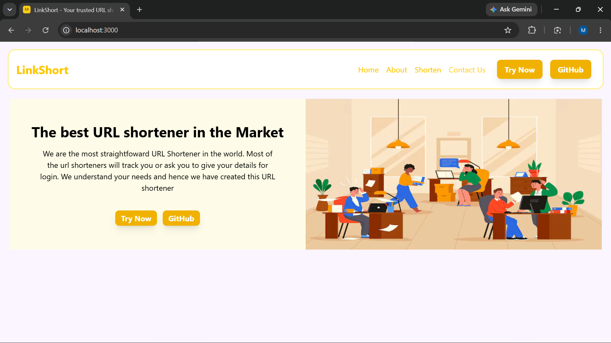
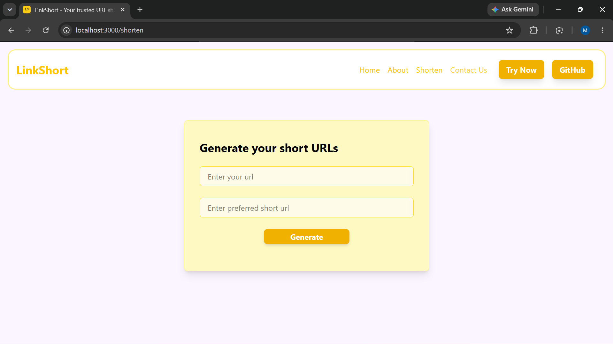
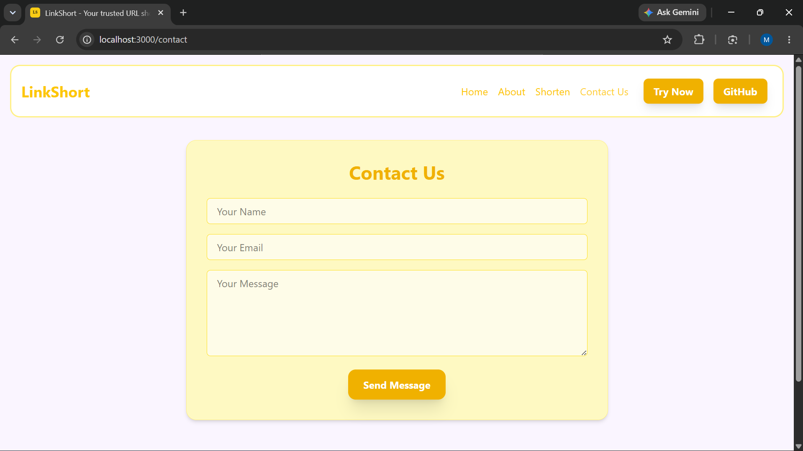
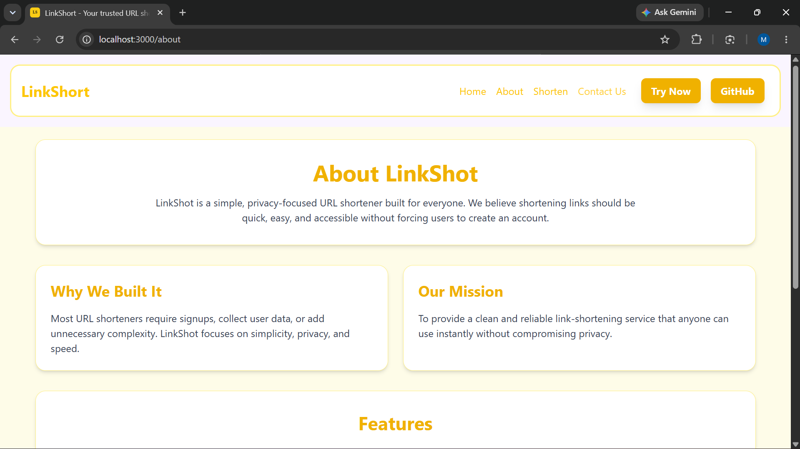

# LinkShort - URL Shortener 🔗

## 📌 Description

LinkShort is a URL shortening web application built using Next.js, MongoDB, and Tailwind CSS.

The application allows users to generate short and shareable links without requiring authentication. Users can also create custom short URLs and send messages through a contact form that stores submissions in MongoDB.

---

## 🚀 Features

* Shorten long URLs instantly
* Create custom short links
* Fast redirection using dynamic routes
* Contact form with MongoDB storage
* Privacy-focused (no analytics or tracking)
* Responsive user interface
* Modern yellow-themed design

---

## 🛠️ Tech Stack

### Frontend

* Next.js (App Router)
* React
* Tailwind CSS

### Backend

* Next.js API Routes
* Node.js

### Database

* MongoDB (Native Driver)

---

## 📂 Functionalities Implemented

* URL shortening system
* Custom slug generation
* Dynamic route handling
* MongoDB integration
* Form handling and validation
* Contact message storage
* Responsive navigation

---

## 📷 Screenshots

### Home Page



### URL Shortener




### Contact Page



### About Page



---

## ▶️ How to Run

### Clone Repository

```bash
git clone https://github.com/mohmmadkaif7/LinkShort-URL-Shortener.git
```

### Navigate to Project

```bash
cd linkshort
```

### Install Dependencies

```bash
npm install
```

### Create Environment Variables

Create a file named:

```text
.env.local
```

Add:

```env
MONGODB_URI=your_mongodb_connection_string
```

### Run Development Server

```bash
npm run dev
```

Open:

```text
http://localhost:3000
```

---

## 📁 Project Structure

```text
LINKSHORT/
│
├── app/
│   ├── [shorturl]/
│   ├── about/
│   ├── api/
│   │   ├── contact/
│   │   └── generate/
│   ├── contact/
│   ├── shorten/
│   ├── globals.css
│   ├── layout.js
│   └── page.js
│
├── components/
│   └── Navbar.js
│
├── data/
│
├── lib/
│   └── mongodb.js
│
├── public/
│
├── package.json
├── README.md
└── .gitignore
```

---

## 🌐 Future Improvements

* QR code generation
* User authentication
* Link expiration support
* Link management dashboard
* Click analytics
* Custom domains

---

## 👨‍💻 Author

Mohmmad Kaif 

---

## ⭐ Support

If you found this project useful, consider giving it a star on GitHub.
